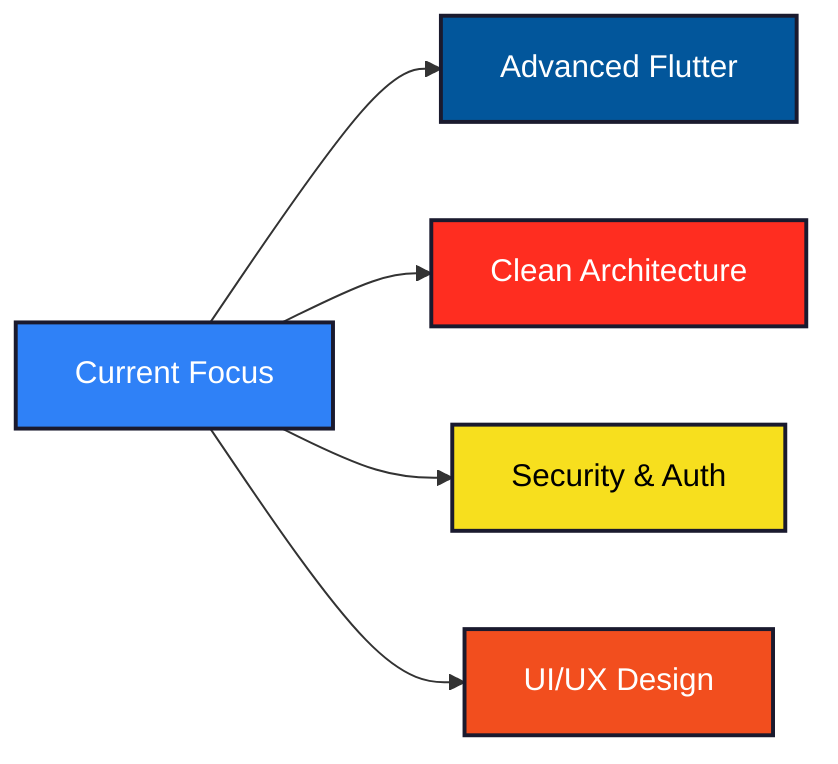

  
  #  Hi, I'm Syaa
  
  
  
  
  

##  About Me

  <samp>
    Informatics Engineering with a strong passion for Full Stack Development.
    Experienced in building complete applications from database design to frontend implementation.
    Currently diving deeper into Backend Architecture and Clean Code principles.
    Always eager to learn new technologies and improve my craft.
  </samp>

  <samp>
    <strong>Focus:</strong> Full Stack Development • Database Design • Clean Architecture
  </samp>

##  Tech Stack

### Design & Prototyping

  

### Mobile Development

  

### Frontend Development

  

### Backend Development

  

### Database & Storage

  

### Tools & Platforms

  

### AI & Machine Learning

  

##  GitHub Analytics

  
  

  

##  Featured Projects

<table>
  <tr>
    <td align="center" width="50%">
      <h3>Quran Memo App</h3>
      
Flutter-based memorization tracking app with comprehensive features for modern learning experience

      

        <strong>Features:</strong> 
        Camera | Audio Recording | Gamification 
        Payment Gateway | SQLite | PostgreSQL
      

      

        <strong>Backend:</strong> Laravel REST API
      

      

        
      

      <a href="https://github.com/Punaa-Embrace/QuranMemo">View Project</a>
    </td>
    <td align="center" width="50%">
      <h3>Kanteen Mobile Application</h3>
      
Hybrid app integrated with web backend — one API for both platforms

      

        
      

      <a href="https://github.com/Punaa-Embrace/Kantin-Fullstack">View Project</a>
    </td>
  </tr>
</table>

##  Current Learning Goals

##  Let's Connect

  
  
  
  
  

---

##  Code Philosophy

  <samp>
    "First, solve the problem. Then, write the code."
  </samp>

  <samp>Thanks for stopping by! Have a great day.</samp>

